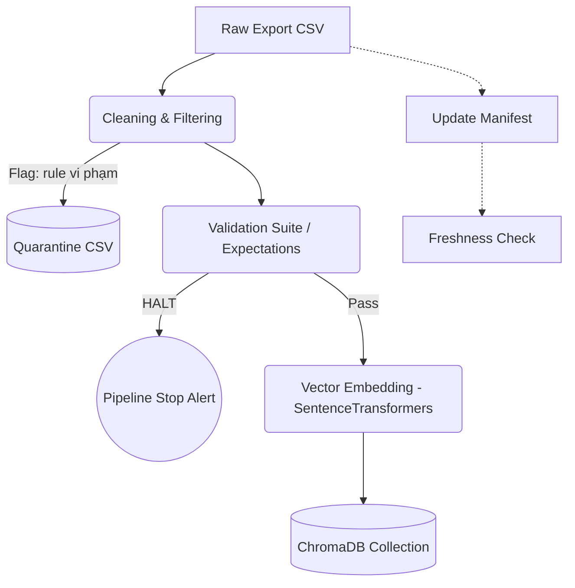

# Kiến trúc pipeline — Lab Day 10

**Nhóm:** D3 - C401 (Antigravity)  
**Cập nhật:** 15/04/2026

---

## 1. Sơ đồ luồng (bắt buộc có 1 diagram: Mermaid / ASCII)

> Vẽ thêm: điểm đo **freshness**, chỗ ghi **run_id**, và file **quarantine**.
Freshness được check cuối pipeline ứng với `manifest.json`. `run_id` được ghi nhận từ đầu và hash lưu vào manifest, logs file và logs của Chroma metadata.

---

## 2. Ranh giới trách nhiệm

| Thành phần | Input | Output | Owner nhóm |
|------------|-------|--------|--------------|
| Ingest | data/raw/*.csv | dict stream array | Ingestion Owner |
| Transform | dict stream | cleaned_csv, quarantine_csv | Cleaning Owner |
| Quality | cleaned_csv | expectation results | Quality Owner |
| Embed | cleaned_csv | chromadb updates (upsert) | Embed Owner |
| Monitor | manifest.json | freshness SLA status | Monitoring Owner |

---

## 3. Idempotency & rerun

> Mô tả: upsert theo `chunk_id` hay strategy khác? Rerun 2 lần có duplicate vector không?

Pipeline tiến hành upsert vào ChromaDB sử dụng index `chunk_id` được sinh ra từ hash SHA-256(`doc_id` + `chunk_text` + `seq`). Việc này bảo đảm idempotency. Ngoài ra, pipeline áp dụng "Prune IDs": check tất cả vector hiện hữu và xóa các vector không còn tồn tại trong run mới nhất, tránh dangling mồi cũ.
Rerun 2 lần hoàn toàn an toàn và không ra duplicated vector.

---

## 4. Liên hệ Day 09

> Pipeline này cung cấp / làm mới corpus cho retrieval trong `day09/lab` như thế nào? (cùng `data/docs/` hay export riêng?)

Pipeline đóng vai trò độc lập, nhận external export (`.csv`) và sync vector embeddings vào kho lưu trữ ChromaDB. Nó cập nhật cho Agent (của Lab Day 09) một collection chuẩn hóa, tách biệt Data Extraction (trích xuất) khỏi Data Retrieval (truy vấn). Agent Day 09 có thể cắm trực tiếp vào DB này.

---

## 5. Rủi ro đã biết

- Nếu `chunk_id` strategy phụ thuộc vào chunk_text, một minor typo fix ở root sẽ delete id cũ và insert id mới; không tận dụng cache vector update.
- SLA Freshness check phụ thuộc cron-driven `python etl_pipeline freshness`. Nên dùng event-driven push qua hệ thống ops/monitoring hơn (Prometheus/DataDog).
